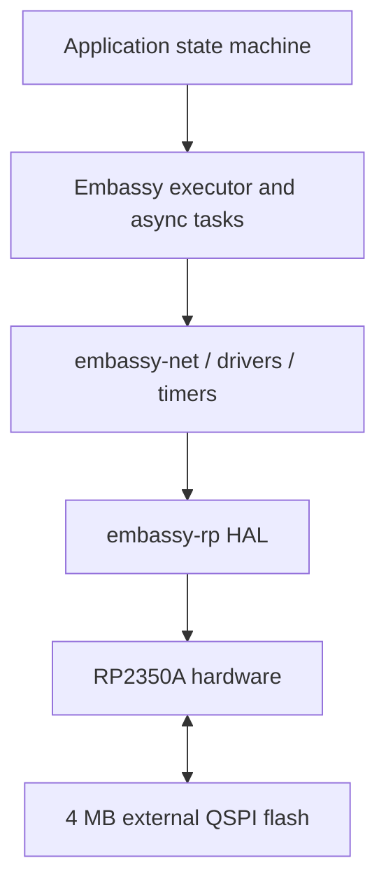
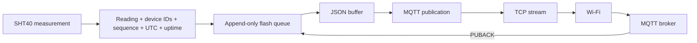
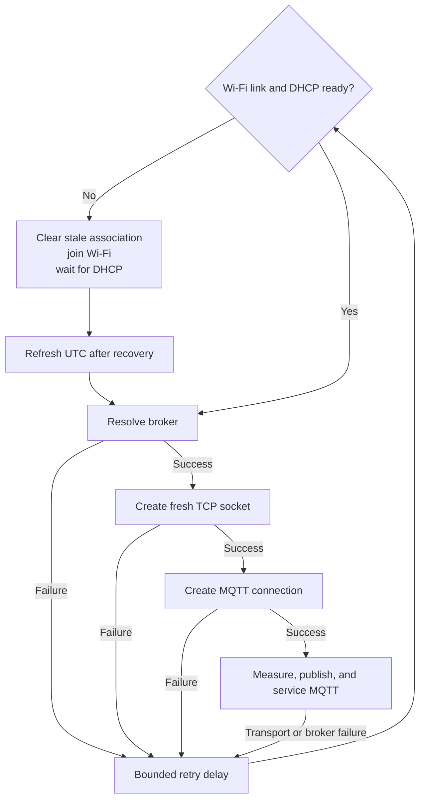

# Pico Data Logger Architecture

PicoDataLogger is bare-metal Rust firmware for a Raspberry Pi Pico 2 W. It reads an SHT40 sensor, establishes UTC with NTP, encodes readings as JSON, and publishes them to MQTT while recovering from ordinary sensor and network failures.

The [README](../README.md) is the operational runbook for wiring, configuration, flashing, monitoring, and fault testing. This document explains how the firmware is structured internally.

## Platform and execution model

The firmware targets the RP2350A's Arm Cortex-M33 cores with `thumbv8m.main-none-eabihf` and is compiled with:

```rust
#![no_std]
#![no_main]
```

There is no conventional operating system: no processes, OS threads, virtual memory, filesystem, or OS socket API. The `core` crate still provides language fundamentals such as `Option`, `Result`, slices, iterators, and traits. This firmware does not configure a heap allocator; long-lived storage and protocol buffers have fixed sizes.

Embassy supplies the asynchronous executor, hardware abstraction layer, timers, and network stack. Async tasks yield while waiting for hardware, network traffic, or deadlines, allowing other firmware tasks to run without OS threads.



The RP2350A provides two Cortex-M33 cores, 520 kB of SRAM, hardware floating point, and the peripherals used by the firmware. The Pico 2 W board supplies external QSPI flash for program storage and a CYW43439 radio for Wi-Fi.

### Flash layout

The linker divides the Pico 2 W's 4 MiB external flash into two non-overlapping regions:

| Region | Address range | Capacity | Owner |
| --- | --- | ---: | --- |
| Firmware | `0x10000000..0x103c0000` | 3,840 KiB | Linker |
| Measurement storage | `0x103c0000..0x10400000` | 256 KiB | Application |

The measurement-storage region occupies the final 64 4-KiB erase sectors. Its start and size are erase-aligned so queue code can erase sectors without touching firmware bytes. `memory.x` fails the link if the firmware image reaches the reserved region and exports `__storage_start` and `__storage_end` for the flash driver integration.

Each append-only record occupies one 256-byte page. A CRC-32 protects its versioned contents, and a commit marker is written last so recovery can reject interrupted writes. Acknowledgment clears another state bit after MQTT PUBACK. The queue keeps one sector as circular working space, batches erases by 16 records, and reconstructs ordering by sequence number after reboot. Its usable capacity is 1,008 readings, or 16 hours and 48 minutes at the 60-second interval.

## Runtime tasks

Four long-lived async execution paths cooperate on the Embassy executor:

| Execution path | Responsibility |
| --- | --- |
| USB logger task | Runs USB CDC logging independently of application recovery. |
| CYW43439 runner | Services communication with the Wi-Fi radio. |
| `embassy-net` runner | Drives DHCP, DNS, UDP, and TCP network progress. |
| Main application | Owns the SHT40, clock anchor, MQTT session, fixed buffers, sampling schedule, and recovery supervisor. |

The logger and network runners are spawned before the main application begins joining Wi-Fi. A failed sensor read, NTP request, or MQTT connection therefore does not intentionally stop USB diagnostics or the lower-level network drivers.

## Hardware connections

The SHT40 uses the RP2350's I2C0 peripheral. These assignments are part of the project contract and must remain unchanged:

| SHT40 signal | Pico 2 W connection | Physical pin |
| --- | --- | ---: |
| VCC | 3V3 OUT | 36 |
| GND | GND | 3 |
| SDA | GP0 / I2C0 SDA | 1 |
| SCL | GP1 / I2C0 SCL | 2 |

The CYW43439 is a separate radio chip. The RP2350 communicates with it through the `cyw43` driver using a PIO-backed SPI bus and DMA. To the application, the radio becomes an `embassy-net` network device rather than an operating-system interface.


## Data and protocol flow

A successful reading crosses several distinct layers:



- I2C transports sensor commands and measurements.
- `Reading` gives the measurement a typed representation.
- `serde-json-core` serializes into caller-owned fixed storage.
- MQTT defines the topic, publication, session, and keepalive behavior.
- TCP provides MQTT with an ordered byte stream.
- Wi-Fi carries IP traffic to the configured broker.

MQTT publications use QoS 1 and are not retained. Each payload carries the configured MQTT client ID base as its human-readable `device_id` and the RP2350 OTP chip ID as `hardware_id`. The broker connection client ID is `<device_id>-<hardware_id>`, so physical devices remain unique even when a logical name is accidentally reused. Records remain in flash until PUBACK, so a reset between broker delivery and local retirement can replay the same `(hardware_id, sequence)` pair. This is intentionally at-least-once rather than exactly-once delivery.

## Time model

Embassy's `Instant` is monotonic: it measures elapsed time but has no relationship to a calendar epoch. NTP supplies whole UTC seconds, which the firmware stores beside `Instant::now()` as a clock anchor:

```text
current Unix time = anchored Unix time + monotonic elapsed seconds
```

The firmware validates the NTP packet before accepting its timestamp, including its length, server mode, leap indicator, stratum, and request/originate timestamp relationship. Checked arithmetic rejects timestamps before the Unix epoch and detects anchor overflow.

Startup does not proceed to MQTT until the first valid anchor exists. Later refresh failures retain the last valid anchor rather than replacing UTC with uptime. Refresh occurs after network recovery and at least daily; failures retry with bounded backoff.

## Fixed memory and ownership

The firmware reuses fixed-size storage instead of allocating per operation:

| Buffer | Size | Purpose |
| --- | ---: | --- |
| Reading JSON | 128 bytes | Serialized sensor payload. |
| TCP receive | 1024 bytes | MQTT transport input. |
| TCP transmit | 1024 bytes | MQTT transport output. |
| MQTT packet receive | 512 bytes | MQTT decoder storage. |
| MQTT packet transmit | 1024 bytes | MQTT encoder storage. |
| NTP receive | 512 bytes | UDP response storage. |
| NTP transmit | 48 bytes | One NTP request. |

Rust ownership keeps those buffers from being reused while an async operation still borrows them. The JSON encoder returns a slice whose lifetime is tied to the caller's buffer, preventing that slice from outliving its storage. Encoding and clock arithmetic return explicit errors rather than panicking on undersized storage or overflow.

## Recovery supervisor

After configuration and initial UTC synchronization, the main application runs a forever supervisor:



Recovery follows the failed layer:

- A sensor error skips one sample but preserves a healthy MQTT connection.
- DNS, TCP, MQTT handshake, publish, keepalive, or disconnect failures discard the MQTT connection and TCP socket. Publish submission and PUBACK waits are bounded to 15 seconds, and a connected TCP socket is bounded by a 120-second receive-inactivity timeout. Timed-out QoS 1 records remain in flash for replay. The next attempt re-resolves DNS and creates fresh transport state.
- Link loss clears stale CYW43439 association state, rejoins Wi-Fi with a bounded attempt, waits for DHCP, and then rebuilds time and broker state. Startup also bounds DHCP acquisition to 30 seconds and rejoins Wi-Fi after a timeout.
- MQTT reconnection and UTC refresh delays grow through 1, 2, 4, 8, 16, 32, and 60 seconds, then remain capped. Successful recovery resets the applicable backoff.

Only invalid compile-time application configuration reaches the deliberate parked diagnostic state. Runtime network and service failures continue retrying.

## Verification boundary

Host tests cover pure logic such as JSON encoding, retry progression, NTP packet validation, epoch conversion, and checked timestamp derivation. CI also checks formatting, Clippy, and a release cross-build for the Pico target.

A successful cross-build cannot prove physical behavior. USB enumeration, I2C wiring, SHT40 reads, CYW43439 association, DHCP, real NTP traffic, and MQTT delivery require the hardware checks documented in the README.

## Security boundary

This design is intended for a trusted LAN:

- MQTT is plaintext and does not authenticate the broker with TLS.
- NTP responses are structurally validated but not cryptographically authenticated.
- Wi-Fi and optional MQTT credentials are embedded in the compiled firmware.

TLS, authenticated time, and protected credential provisioning belong in a separate production-hardening design.
