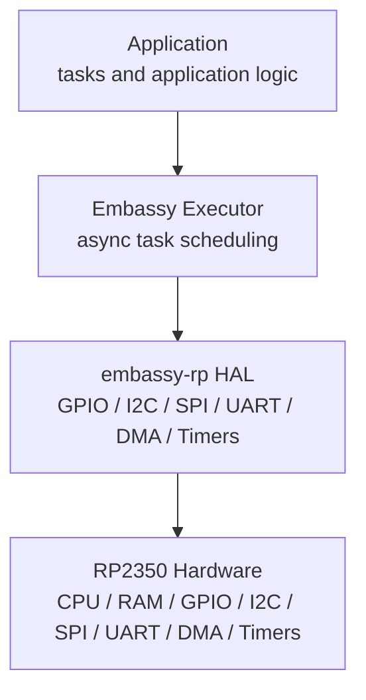
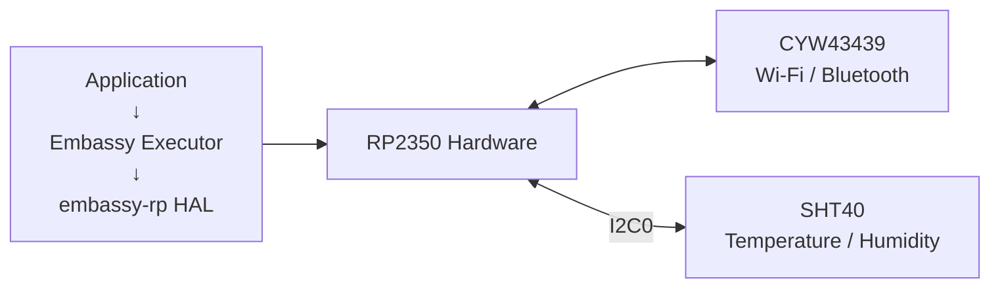

# Embedded Architecture

## 1. Bare-Metal and `no_std`

PicoDataLogger runs **bare-metal** on the RP2350. There is no conventional operating system underneath the firmware: no OS processes, virtual memory, system calls, or OS-managed threads.

The firmware is compiled with:

```rust
#![no_std]
```

`#![no_std]` means Rust's normal `std` library is not linked. It does **not** mean Rust has no standard language/runtime facilities.

The `core` crate remains available and provides fundamental Rust functionality including:

- Primitive types
- `Option` and `Result`
- Slices
- Iterators
- Formatting traits
- Basic memory and pointer operations
- Core language traits such as `Copy`, `Clone`, and `Iterator`

The `alloc` crate can optionally provide heap-backed types such as `Vec`, `String`, and `Box`, but only when the firmware configures an allocator.

There is no operating system providing services such as files, processes, sockets, or threads. Hardware access and concurrency are instead provided directly by the firmware, Embassy, hardware peripherals, and interrupts.

---

## 2. Embassy Stack

PicoDataLogger uses Embassy to provide an asynchronous programming model on top of the RP2350 hardware without requiring an operating system.



The **application** contains the device's behavior and asynchronous tasks.

The **Embassy executor** runs those async tasks, wakes them when events occur, and can allow the CPU to sleep when no task has work to perform.

The **`embassy-rp` HAL** exposes Rust APIs for configuring and controlling RP2350 hardware such as GPIO, I2C, SPI, timers, and DMA.

At the bottom is the **RP2350 hardware** itself. HAL operations ultimately become CPU instructions that read and write memory-mapped hardware registers.

---

## 3. External Devices

The CYW43439 radio and SHT40 sensor are external devices connected to the RP2350. They sit beside the main software stack rather than forming additional layers underneath it.



### SHT40

The SHT40 temperature and humidity sensor is connected using the RP2350's **I2C0** peripheral:

| SHT40 | RP2350 |
|---|---|
| SDA | GP0 / I2C0 SDA |
| SCL | GP1 / I2C0 SCL |
| VCC | 3V3 |
| GND | GND |

Application code communicates with the SHT40 through its driver, which uses the `embassy-rp` I2C implementation to operate the RP2350's I2C0 peripheral.

### CYW43439

The CYW43439 is a separate Wi-Fi/Bluetooth radio chip. The RP2350 communicates with it through hardware interfaces and a driver rather than through an operating-system network device.

Both devices ultimately interact with application code through roughly the same pattern:


---

## 4. Important Terms

**Compiler target** — Defines the CPU architecture, instruction set, ABI, and execution environment for which Rust generates machine code.

**`no_std`** — A Rust compilation mode where the `std` crate is unavailable; the platform-independent `core` crate remains available, and `alloc` can optionally be used when an allocator is provided.

**`core`** — Rust's platform-independent foundational library providing primitive types and operations, `Option`, `Result`, slices, iterators, formatting traits, and other functionality that does not require operating-system services.

**HAL** — A Hardware Abstraction Layer provides Rust APIs for controlling hardware peripherals without requiring application code to manipulate hardware registers directly.

**Executor** — A runtime component that runs asynchronous tasks, wakes tasks when they can make progress, and determines what code should execute next without requiring OS threads.

**Interrupt** — A hardware-generated event that temporarily redirects CPU execution to an interrupt handler so an event can be serviced promptly.

**Firmware image** — The compiled binary containing the program and associated data that is written to the device's nonvolatile memory and executed when the processor boots.