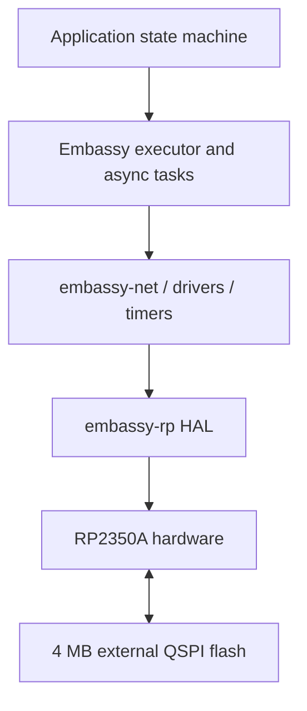
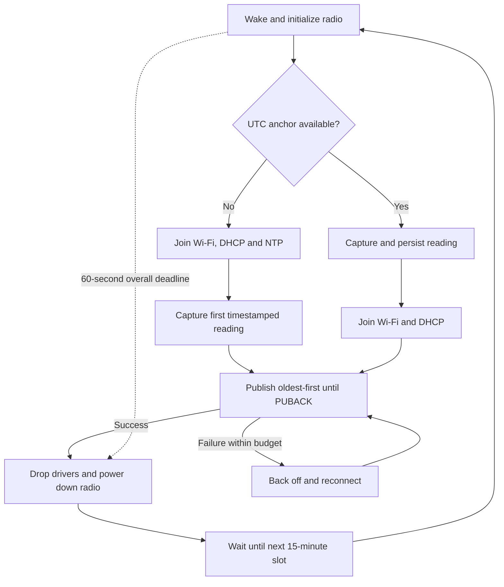

# Pico Data Logger Architecture

PicoDataLogger is bare-metal Rust firmware for a Raspberry Pi Pico 2 W. It reads an SHT40 sensor, establishes UTC with NTP, encodes readings as JSON, and publishes them to MQTT while recovering from ordinary sensor and network failures.

The [README](../README.md) is the operational runbook for wiring, configuration, flashing, monitoring, and fault testing. This document explains how the firmware is structured internally.

## Platform and execution model

The firmware targets the RP2350A's Arm Cortex-M33 cores with `thumbv8m.main-none-eabihf` and is compiled with:

```rust
#![no_std]
#![no_main]
```

There is no conventional operating system: no processes, OS threads, virtual memory, filesystem, or OS socket API. The `core` crate still provides language fundamentals such as `Option`, `Result`, slices, iterators, and traits. This firmware does not configure a heap allocator; long-lived storage and protocol buffers have fixed sizes.

Embassy supplies the asynchronous executor, hardware abstraction layer, timers, and network stack. Async tasks yield while waiting for hardware, network traffic, or deadlines, allowing other firmware tasks to run without OS threads.


```mermaid
flowchart TD
    APP["Application state machine"]
    TASKS["Embassy executor and async tasks"]
    SERVICES["embassy-net / drivers / timers"]
    HAL["embassy-rp HAL"]
    RP["RP2350A hardware"]
    FLASH["4 MB external QSPI flash"]

    APP --> TASKS
    TASKS --> SERVICES
    SERVICES --> HAL
    HAL --> RP
    RP <--> FLASH
```

The RP2350A provides two Cortex-M33 cores, 520 kB of SRAM, hardware floating point, and the peripherals used by the firmware. The Pico 2 W board supplies external QSPI flash for program storage and a CYW43439 radio for Wi-Fi.

### Flash layout

The linker divides the Pico 2 W's 4 MiB external flash into two non-overlapping regions:

| Region | Address range | Capacity | Owner |
| --- | --- | ---: | --- |
| Firmware | `0x10000000..0x103c0000` | 3,840 KiB | Linker |
| Measurement storage | `0x103c0000..0x10400000` | 256 KiB | Application |

The measurement-storage region occupies the final 64 4-KiB erase sectors. Its start and size are erase-aligned so queue code can erase sectors without touching firmware bytes. `memory.x` fails the link if the firmware image reaches the reserved region and exports `__storage_start` and `__storage_end` for the flash driver integration.

Each append-only record occupies one 256-byte page. Version 2 adds the VSYS voltage captured with the sensor measurement; version 1 records remain readable with an unavailable (`null`) voltage. Version 3 adds an optional `on_battery` flag in a checksummed reserved byte; versions 1 and 2 decode that flag as unknown. A CRC-32 protects its versioned contents, and a commit marker is written last so recovery can reject interrupted writes. Acknowledgment clears another state bit after MQTT PUBACK. The queue keeps one sector as circular working space, batches erases by 16 records, and reconstructs ordering by sequence number after reboot. Its usable capacity is 1,008 readings, or 10 days and 12 hours at the 15-minute interval.

## Runtime tasks

USB logging is the only independently spawned long-lived task. Each wake cycle constructs fresh CYW43439 state, PIO/SPI/DMA and ADC drivers, network resources, DHCP state, and MQTT sessions. `select3` polls the application and both driver runners concurrently. The entire scope, including radio initialization, is wrapped in a 60-second timeout.

On success or timeout, the scope drops pending transfers and drivers before GP23 is driven low to power down the radio. Rust peripheral reborrows ensure the next cycle cannot create drivers until the previous owners are gone. The sensor, flash queue, UTC anchor, and scheduler remain alive across cycles. Voltage request/response signals are reset for each new radio scope.

Battery operation then enters clock-gated SLEEP with both PLLs stopped and only the POWMAN reference clock enabled in the sleep clock masks. The crystal-clocked AON timer supplies the wake interrupt. Other NVIC interrupts are temporarily masked, and clocks and masks are restored before any handler or task resumes. USB-powered or unknown-power operation uses an async wait instead. SRAM and oscillators remain powered; this is not DORMANT or a full power-domain shutdown.

## Hardware connections

The SHT40 uses the RP2350's I2C0 peripheral. These assignments are part of the project contract and must remain unchanged:

| SHT40 signal | Pico 2 W connection | Physical pin |
| --- | --- | ---: |
| VCC | 3V3 OUT | 36 |
| GND | GND | 3 |
| SDA | GP0 / I2C0 SDA | 1 |
| SCL | GP1 / I2C0 SCL | 2 |

The CYW43439 is a separate radio chip. The RP2350 communicates with it through the `cyw43` driver using a PIO-backed SPI bus and DMA. To the application, the radio becomes an `embassy-net` network device rather than an operating-system interface.


```mermaid
flowchart LR
    SHT["SHT40"] <-->|"I2C0: GP0/GP1"| RP["RP2350A"]
    RP <-->|"PIO SPI + DMA"| RADIO["CYW43439"]
    RADIO <-->|"Wi-Fi"| LAN["LAN / Internet"]
```

## Data and protocol flow

A successful reading crosses several distinct layers:


```mermaid
flowchart LR
    SENSOR["SHT40 measurement"]
    READING["Reading + device IDs + sequence + UTC + uptime"]
    QUEUE["Append-only flash queue"]
    JSON["JSON buffer"]
    MQTT["MQTT publication"]
    TCP["TCP stream"]
    WIFI["Wi-Fi"]
    BROKER["MQTT broker"]

    SENSOR --> READING --> QUEUE --> JSON --> MQTT --> TCP --> WIFI --> BROKER
    BROKER -->|"PUBACK"| QUEUE
```

- I2C transports sensor commands and measurements.
- `Reading` gives the measurement a typed representation, including optional `vsys_voltage_v` and `on_battery`. Power-source detection reads CYW43439 WL_GPIO2 (USB VBUS present) through the control task before each voltage sample, with a one-second timeout. Both values are persisted before publication.
- `voltage::VoltageSpi` wraps the radio SPI bus and handles ADC3 requests only between completed transactions with CS high. It disables GPIO29 digital pad functions during a synchronous, averaged ADC read, restores the pad, and resumes SPI. The application waits at most one second and records `null` on failure; it never substitutes an old voltage.
- `serde-json-core` serializes into caller-owned fixed storage.
- MQTT defines the topic, publication, session, and keepalive behavior.
- TCP provides MQTT with an ordered byte stream.
- Wi-Fi carries IP traffic to the configured broker.

MQTT publications use QoS 1 and are not retained. Each payload carries the configured MQTT client ID base as its human-readable `device_id` and the RP2350 OTP chip ID as `hardware_id`. The broker connection client ID is `<device_id>-<hardware_id>`, so physical devices remain unique even when a logical name is accidentally reused. Records remain in flash until PUBACK, so a reset between broker delivery and local retirement can replay the same `(hardware_id, sequence)` pair. This is intentionally at-least-once rather than exactly-once delivery.

## Time model

Embassy's `Instant` stops during clock-gated sleep. `power::now()` adds AON-measured elapsed sleep, excluding entry/exit time already counted by Embassy. NTP supplies whole UTC seconds, stored beside this application clock as an anchor:

```text
current Unix time = anchored Unix time + monotonic elapsed seconds
```

The firmware validates the NTP packet before accepting its timestamp, including its length, server mode, leap indicator, stratum, and request/originate timestamp relationship. Checked arithmetic rejects timestamps before the Unix epoch and detects anchor overflow.

Startup does not proceed to MQTT until the first valid anchor exists. Later refresh failures retain the last valid anchor rather than replacing UTC with uptime. Refresh is attempted when due, normally daily, with a 10-second limit within the overall awake budget. On failure the existing anchor remains valid and refresh is retried in a later cycle. Network timeout futures use only the native awake clock. Application scheduling and uptime use the sleep-aware clock.

## Fixed memory and ownership

The firmware reuses fixed-size storage instead of allocating per operation:

| Buffer | Size | Purpose |
| --- | ---: | --- |
| Reading JSON | 384 bytes | Serialized sensor and VSYS-voltage payload. |
| TCP receive | 1024 bytes | MQTT transport input. |
| TCP transmit | 1024 bytes | MQTT transport output. |
| MQTT packet receive | 512 bytes | MQTT decoder storage. |
| MQTT packet transmit | 1024 bytes | MQTT encoder storage. |
| NTP receive | 512 bytes | UDP response storage. |
| NTP transmit | 48 bytes | One NTP request. |

Rust ownership keeps those buffers from being reused while an async operation still borrows them. The JSON encoder returns a slice whose lifetime is tied to the caller's buffer, preventing that slice from outliving its storage. Encoding and clock arithmetic return explicit errors rather than panicking on undersized storage or overflow.

## Bounded upload cycles


```mermaid
flowchart TD
    WAKE[Wake and initialize radio] --> CLOCK{UTC anchor available?}
    CLOCK -->|Yes| SAMPLE[Capture and persist reading]
    SAMPLE --> JOIN[Join Wi-Fi and DHCP]
    CLOCK -->|No| FIRST[Join Wi-Fi, DHCP and NTP]
    FIRST --> SAMPLEFIRST[Capture first timestamped reading]
    SAMPLEFIRST --> UPLOAD[Publish oldest-first until PUBACK]
    JOIN --> UPLOAD
    UPLOAD -->|Success| STOP[Drop drivers and power down radio]
    WAKE -. 60-second overall deadline .-> STOP
    UPLOAD -->|Failure within budget| RETRY[Back off and reconnect]
    RETRY --> UPLOAD
    STOP --> SLEEP[Wait until next 15-minute slot]
    SLEEP --> WAKE
```

The deadline also covers join, DHCP, DNS, first-boot NTP, and backlog draining. Unacknowledged records remain in flash. Samples are taken before connection attempts once a UTC anchor exists. A cold boot without NTP skips new samples instead of substituting uptime for UTC. A large backlog may require multiple cycles to drain. Missed schedule slots are skipped; successful uploads do not shift the schedule by their connection duration.

See [battery-cycle.md](battery-cycle.md) for a code walkthrough and hardware checks.

## Verification boundary

Host tests cover pure logic such as JSON encoding, retry progression, NTP packet validation, epoch conversion, and checked timestamp derivation. CI also checks formatting, Clippy, and a release cross-build for the Pico target.

A successful cross-build cannot prove physical behavior. USB enumeration, I2C wiring, SHT40 reads, CYW43439 association, DHCP, real NTP traffic, and MQTT delivery require the hardware checks documented in the README.

## Security boundary

This design is intended for a trusted LAN:

- MQTT is plaintext and does not authenticate the broker with TLS.
- NTP responses are structurally validated but not cryptographically authenticated.
- Wi-Fi and optional MQTT credentials are embedded in the compiled firmware.

TLS, authenticated time, and protected credential provisioning belong in a separate production-hardening design.
